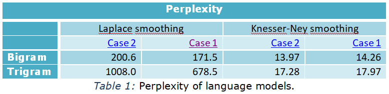
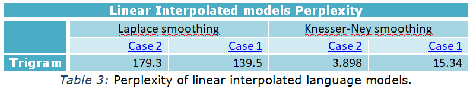

# N-gram Language Models

This is the first assignment for NLP course.
The task is to train
and evaluate language models on an English corpus. We used the English part of <a
 href="http://www.statmt.org/europarl/v7/el-en.tgz">Greek-English parallel corpus</a>.&nbsp;
We download corpus, split it in a train -
test set and so did our train sentences are in file
“europarl-v7.el-en.en.train”&nbsp; and
test sentences in “europarl-v7.el-en.en.test”.
<o:p></o:p>

Special care is given when user is not running
the code for first time so to give user the option to reprocess dataset
and/or
retrain the language models. In case you need access to the already trained
language models please follow this <a
 href="https://www.dropbox.com/sh/1cswfhczdcue1x6/AAC38yxXdjzI_GHZaiRb44ICa?dl=0">link</a>.

## Results
We estimate the language **Cross-Entropy** and **Perplexity** of our models on part of the padded test set (100 sentences), treating it as a single sequence. Function *perplexity()* computes entropy and perplexity for two cases:
1. Including probabilities of the form *P(start|...)* (or *P(start1|...)* or *P(start2|...)*) and *P(end|...)* in the computation of perplexity.
2. Not including probabilities of the form *P(start|...)* (or *P(start1|...)* or *P(start2|...)*) in the computation of perplexity, but including probabilities of the form *P(end|...)*.

In simple **Linear Interpolation**, we combine different order n-grams by linearly interpolating all the models. Here, we combine unigram, bigram and trigram maximum-likelihood estimations using linear interpolation and check if the combined model performs better. Best l1, l2, l3 parameters in perplexity_interpolated() were found after some trials on a validation set of 100 sentences. (l1 = 2/10, l2 = 8/10, l3 = 1/10)

Comparing with Table 1 results we observe that interpolated models have much better perplexity.
